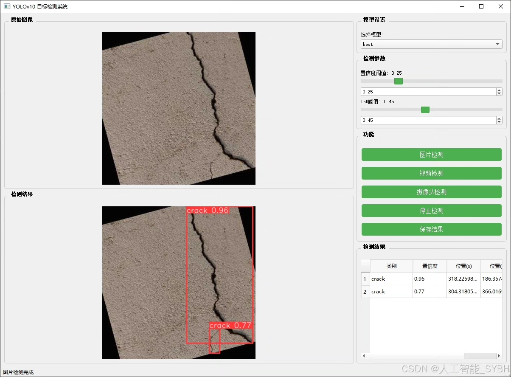
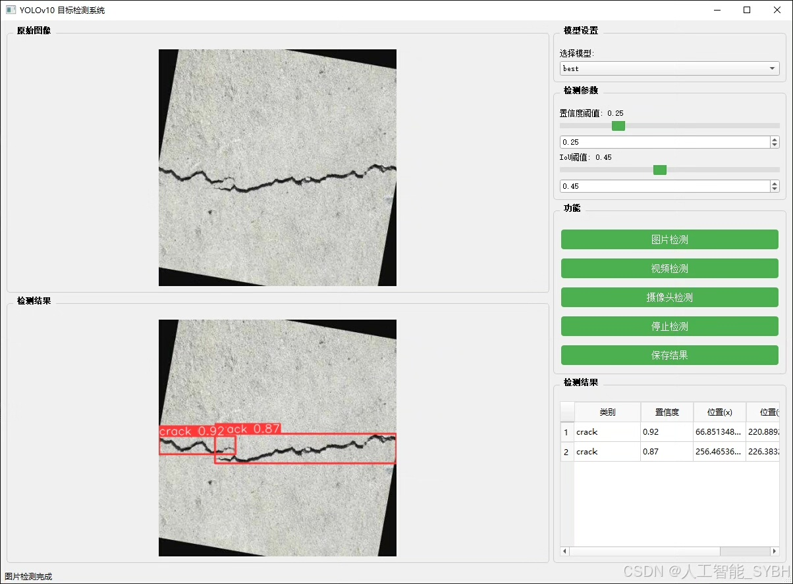
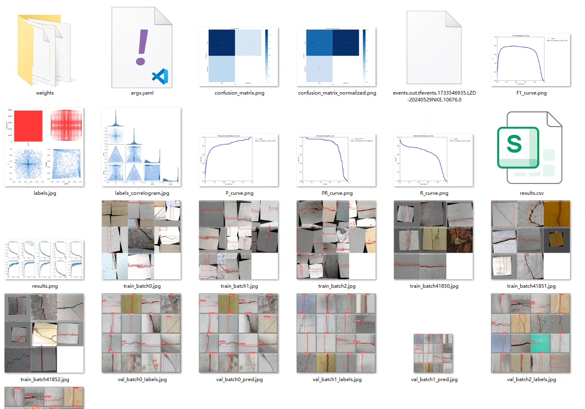
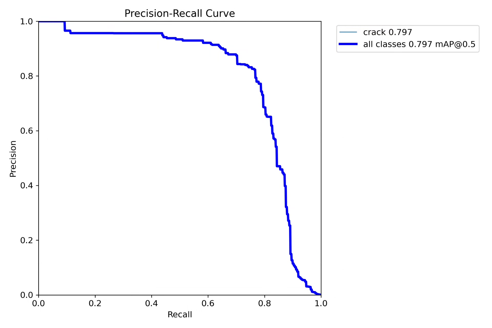
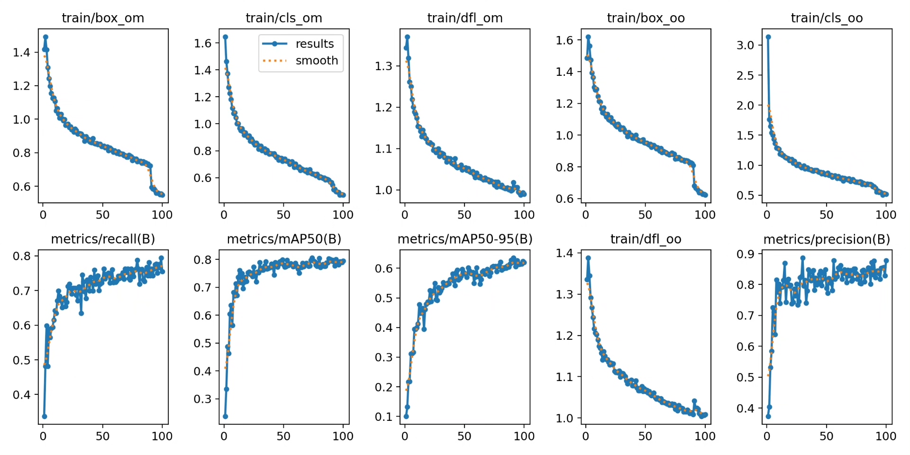
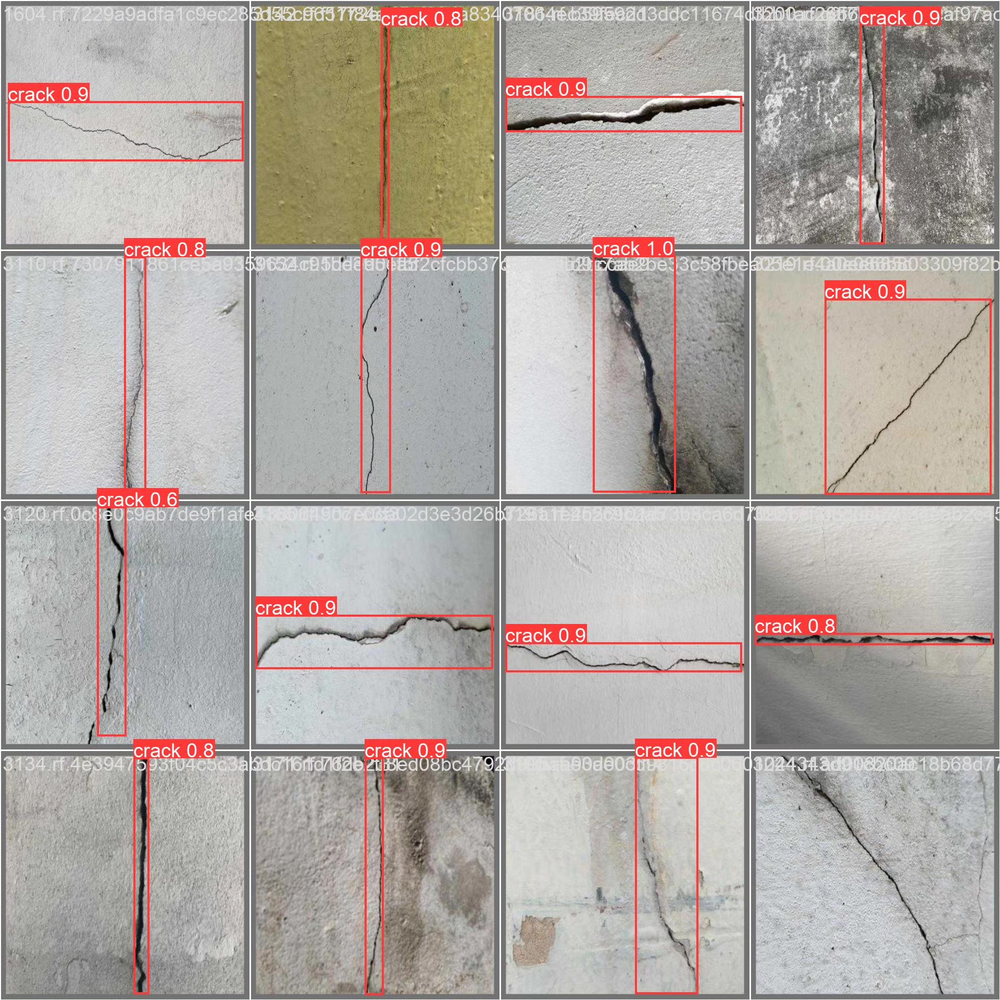
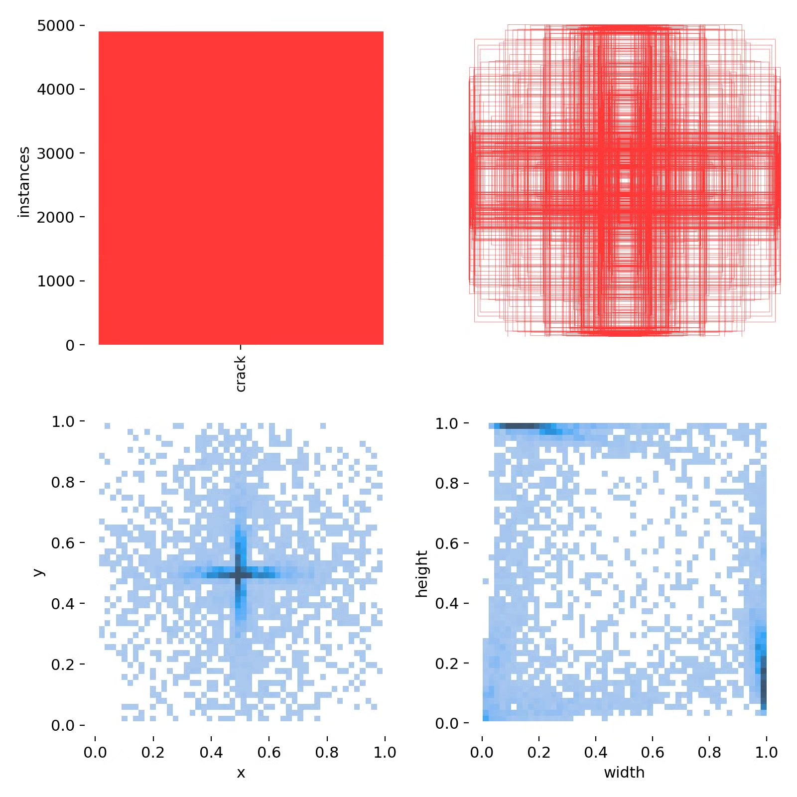
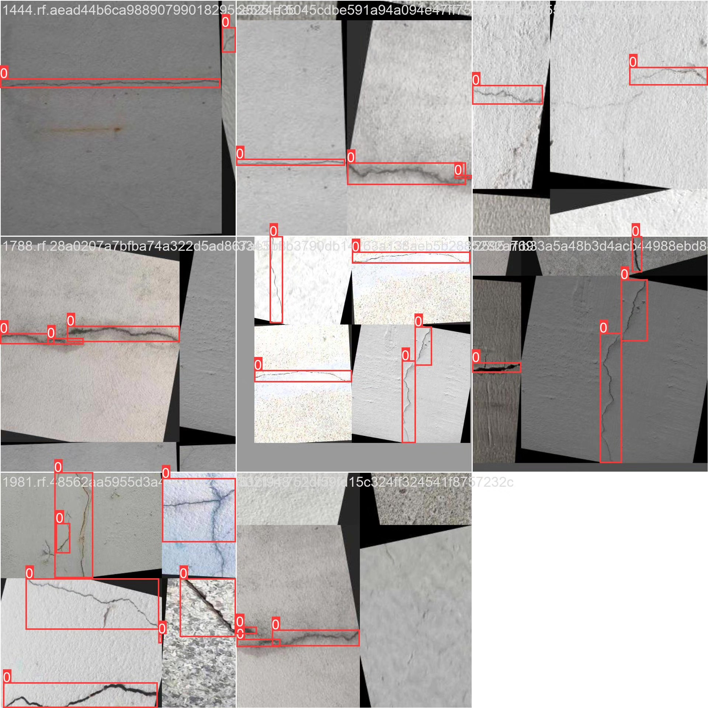

# Crack detection system based on deep learning YOLOv10 (YOLOv10+Y)

## Body

Based on the deep learning YOLOv10, a crack detection system (YOLOv10+YOLO dataset + UI interface + Python project source code + model) is developed.

The purpose of this project is to utilize the YOLOv10 object detection algorithm to build an efficient and accurate crack detection system. The system can detect cracks in images or videos in real-time and output the detection results. Through training and optimization of the model, the system can accurately identify cracks in complex backgrounds, meeting the needs of building structure health monitoring and infrastructure maintenance.

The company's products have obtained the official commercial license certification from YOLO.

We provide after-sales service.

After payment, we will provide WeChat ID for any questions.

Environment configuration: We will provide a tutorial on environment configuration, and WeChat will provide answers.

Remote installation service: If you need remote configuration, an additional fee of 69 is required, with all fees refunded if the configuration fails (only refund installation fees for special old computers).

Retraining dataset: After setting up the environment, you can train on your own computer. If you need us to retrain, just pay 69 plus computing power fees (2.5 yuan/hour).

Full after-sales service

## Images

## Payment

Here is a pay link on Stripe ( https://buy.stripe.com/3cs8yP7sY87d0vu9AB ). Please contact me lonlonago@foxmail.com after funding $89, and I will send you a complete data files , thank you!

